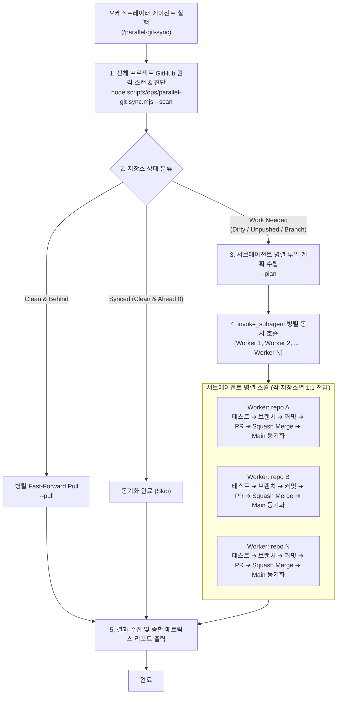

# parallel-git-sync — 서브에이전트 병렬 다중 프로젝트 GitHub 동기화 & PR 스쿼시 머지 스킬

이 스킬은 워크스페이스 내 모든 프로젝트(저장소)를 GitHub 원격(`origin`)과 실시간 비교하고,
**각 프로젝트마다 전용 서브에이전트(Subagent Worker)를 동시에 병렬로 투입**하여:
1. **Clean & Behind 상태인 프로젝트**: 즉각적인 Fast-Forward `git pull origin main` 수행
2. **변경사항(Dirty) 또는 미병합 브랜치가 있는 프로젝트**:
   - 사전 테스트/헬스 게이트 검증
   - 전용 기능 브랜치(`feat/sync-...`) 자동 분기
   - 원자적 커밋 및 원격 푸시
   - **GitHub Pull Request (`gh pr create`) 생성**
   - **단일 원자적 Squash and Merge (`gh pr merge --squash --delete-branch`)**
   - 로컬/원격 작업 브랜치 삭제 및 `main` 최신 동기화

를 완벽히 자율 완결하는 멀티 에이전트 하네스 표준 스킬입니다.

---

## 🛡️ 5대 안전 불변식 (Safety Hard Rules)

1. **Main 브랜치 직접 푸시 엄격 금지 (No Direct Push to Main)**:
   - 모든 변경 작업은 `main`이 아닌 고유 작업 브랜치(`feat/sync-...` 또는 `fix/...`)에서 수행됩니다.
   - `.githooks/pre-push` 가드가 동작하는 저장소의 경우에도 반드시 PR 생성 및 스쿼시 머지 절차를 거칩니다.
2. **단일 PR = 단일 원자적 스쿼시 머지 (Single Squash & Merge)**:
   - 여러 커밋이 발생하더라도 `gh pr merge --squash --delete-branch`를 통해 메인에는 1개의 깔끔하고 검증된 스쿼시 커밋으로만 통합합니다.
3. **독립 서브에이전트 병렬 격리 (Subagent Isolation)**:
   - 각 프로젝트의 동기화 및 PR 처리는 독립된 서브에이전트(`Role: Repo Git Sync - <id>`, `Model: flash` 또는 `inherit`)가 맡아 병렬(`invoke_subagent`)로 처리하며, 타 저장소의 간섭이나 락 충돌을 원천 차단합니다.
4. **테스트/헬스 게이트 통과 후 커밋 (Fail-Closed Health Gate)**:
   - 단위 테스트(`npm test`, `pnpm test`, `go test ./...`, `cargo test` 등)가 설정된 프로젝트는 테스트 검증 후 안전하게 커밋합니다.
5. **무손실 동기화 (Zero Data Loss)**:
   - 충돌이 발생하거나 강제 덮어쓰기(`git reset --hard`, `push --force`)는 금지되며, 문제 발생 시 즉시 에스컬레이션합니다.

---

## 🏗️ 4단계 오케스트레이션 아키텍처



---

## 📋 에이전트 표준 실행 절차 (Step-by-Step)

사용자가 "모든 프로젝트 깃 동기화해줘" 또는 `/parallel-git-sync`를 요청했을 때, 오케스트레이터 에이전트는 다음 순서로 실행합니다:

### [1단계] 전체 프로젝트 스캔 및 상태 진단

터미널 명령으로 워크스페이스 내 모든 GitHub 연결 저장소 상태를 스캔합니다:
```bash
node scripts/ops/parallel-git-sync.mjs --scan
```
- 결과에서 `[SYNCED]`, `[PULLABLE]`, `[WORK NEEDED]`로 분류된 프로젝트 목록을 확인합니다.

### [2단계] Clean 저장소 고속 병렬 깃 풀

작업 트리가 깨끗하고 원격보다 뒤처진(`PULLABLE`) 저장소들은 즉시 병렬로 땡깁니다:
```bash
node scripts/ops/parallel-git-sync.mjs --pull
```

### [3단계] 작업 필요 프로젝트 대상 서브에이전트 병렬 디스패치

`[WORK NEEDED]` 상태인 모든 저장소에 대해 `invoke_subagent` 도구를 **단 1회의 도구 호출**로 동시에 병렬 실행합니다:

```json
{
  "Subagents": [
    {
      "TypeName": "typist",
      "Role": "Repo Git Sync - <repo1>",
      "Model": "flash",
      "Workspace": "inherit",
      "Prompt": "Execute parallel-git-sync on /Users/nm/works/<repo1>:\n1. Check tests if exists.\n2. Switch to branch feat/sync-<repo1>-<timestamp>.\n3. git add -A && git commit -m 'feat(<repo1>): sync local updates'.\n4. git push -u origin <branch>.\n5. gh pr create --title 'feat(<repo1>): sync local updates' --body 'Automated sync via subagent.' --base main.\n6. gh pr merge --squash --delete-branch.\n7. git switch main && git pull origin main.\n8. Return PR # and final status."
    },
    {
      "TypeName": "typist",
      "Role": "Repo Git Sync - <repo2>",
      "Model": "flash",
      "Workspace": "inherit",
      "Prompt": "Execute parallel-git-sync on /Users/nm/works/<repo2>:\n1. Check tests if exists.\n2. Switch to branch feat/sync-<repo2>-<timestamp>.\n3. git add -A && git commit -m 'feat(<repo2>): sync local updates'.\n4. git push -u origin <branch>.\n5. gh pr create --title 'feat(<repo2>): sync local updates' --body 'Automated sync via subagent.' --base main.\n6. gh pr merge --squash --delete-branch.\n7. git switch main && git pull origin main.\n8. Return PR # and final status."
    }
  ]
}
```

> **Tip**: `--plan` 플래그를 실행하면 `invoke_subagent`에 바로 넘길 수 있는 정밀한 JSON 배열을 생성할 수 있습니다:
> ```bash
> node scripts/ops/parallel-git-sync.mjs --plan
> ```

### [4단계] 개별 서브에이전트 작업 실행 규약 (Worker Protocol)

각 서브에이전트는 자신에게 할당된 저장소 디렉토리에서 아래 8단계를 철저히 수행합니다:

1. **디렉토리 진입 및 상태 점검**:
   `git status --porcelain` 및 현재 브랜치 확인
2. **테스트 검증 (Health Check)**:
   `npm test` / `pnpm test` / `go test ./...` / `cargo test` 중 프로젝트에 맞는 테스트 실행 (실패 시 원인 파악 및 중단)
3. **작업 브랜치 분기**:
   현재가 `main`인 경우: `git switch -c feat/sync-<repo-slug>-<timestamp>`
4. **원자적 커밋**:
   `git add -A`  
   `git commit -m "feat(<repo-slug>): sync workspace updates & verify"`
5. **원격 푸시**:
   `git push -u origin <branch>`
6. **GitHub PR 생성**:
   `gh pr create --title "feat(<repo-slug>): sync workspace updates" --body "## Summary\n- Automated parallel workspace sync via subagent.\n\n## Verification\n- Tests & health check passed." --base main`
7. **Squash & Merge 및 원격 브랜치 삭제**:
   `gh pr merge --squash --delete-branch`
8. **메인 복귀 및 최신 풀**:
   `git switch main && git pull origin main && git branch -d <branch>`

### [5단계] 결과 취합 및 종합 리포트 출력

모든 서브에이전트의 작업이 완료되면, 오케스트레이터 에이전트는 아래 형식의 종합 보고서를 마크다운 표로 작성하여 사용자에게 안내합니다:

| 프로젝트명 | 이전 상태 | 작업 브랜치 | PR 번호 | 스쿼시 머지 | 메인 최신화 | 최종 결과 |
| :--- | :---: | :---: | :---: | :---: | :---: | :---: |
| `all_market` | DIRTY (6) | `feat/sync-all_market-...` | #42 | ✅ 완료 | ✅ 완료 | **SUCCESS** |
| `art-study` | DIRTY (21) | `feat/sync-art-study-...` | #18 | ✅ 완료 | ✅ 완료 | **SUCCESS** |
| `book-making-harness` | BEHIND (1) | `main` | N/A (Fast-Pull) | N/A | ✅ 완료 | **SUCCESS** |
| `create-agent-harness` | SYNCED | `main` | N/A | N/A | ✅ 최신 | **SYNCED** |

---

## 💻 CLI 스크립트 단독 실행 안내

서브에이전트 대화형 호출 외에도, 터미널에서 스크립트를 직접 실행할 수 있습니다:

### Linux / macOS
```bash
# 전체 진단
./scripts/ops/parallel-git-sync.mjs --scan

# Clean 저장소 일괄 풀
./scripts/ops/parallel-git-sync.mjs --pull

# 단일 저장소 풀 사이클 실행
./scripts/ops/parallel-git-sync.mjs --sync-repo /Users/nm/works/all_market

# 전체 저장소 자동 배치 병렬 동기화
./scripts/ops/parallel-git-sync.mjs --auto-all
```

### Windows (PowerShell)
```powershell
# 전체 진단
node scripts/ops/parallel-git-sync.mjs --scan

# 스킬 내 번들 스크립트 실행
powershell -ExecutionPolicy Bypass -File .agents/skills/parallel-git-sync/scripts/parallel-git-sync.ps1 -Scan
```

---

## ⚠️ 예외 처리 및 트러블슈팅

1. **`gh: command not found` 또는 인증 만료**:
   - `gh auth status` 확인 후, 미인증 시 `gh auth login`을 안내하거나 원격 브랜치 푸시 후 웹 PR URL 제공.
2. **Merge Conflict (머지 충돌) 발생 시**:
   - `git merge main`을 로컬 작업 브랜치에서 실행하여 충돌을 해결하고 테스트를 통과한 후 푸시합니다. 절대 강제 푸시(`--force`)를 사용하지 않습니다.
3. **사전 테스트 실패 시**:
   - 에러 로그를 분석하여 즉시 수정 가능한 사소한 문제면 수정 후 재시도하고, 의도적인 미완성 작업인 경우 커밋하지 않고 에스컬레이션합니다.
