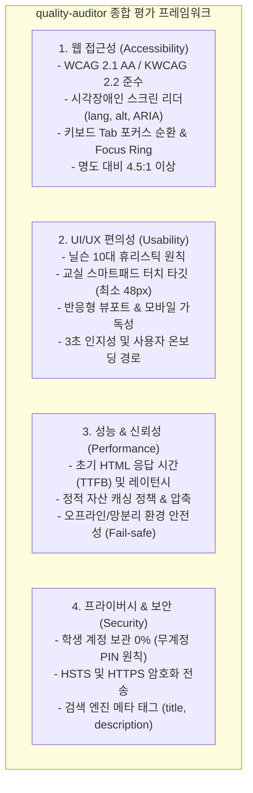

# quality-auditor — 웹 & 데스크톱 앱 종합 품질·접근성·편의성 자동 진단 스킬

이 스킬은 배포된 웹사이트와 로컬/원격 데스크톱 앱의 **웹 접근성(A11y)**, **UI/UX 편의성(Usability)**, **핵심 성능(Performance)**, **SEO 및 프라이버시 원칙**을 원클릭으로 정밀 감사(Audit)하고,
외부 의존성 없이 브라우저에서 바로 열리는 **단독 실행형 대화형 HTML 보고서(`docs/audits/quality-audit-report.html`)**를 생성하여 구체적인 코드 레벨 개선안을 도출합니다.

---

## 🎯 4대 핵심 평가 영역



---

## 🛠️ 실행 방법

### 1단계: 진단 스크립트 실행 (CLI)

```bash
# 기본 대상(edulinker.kr, cloud-school.kr, 구름학교 런처/에디터) 일괄 진단
node scripts/ops/audit-quality.mjs

# 특정 URL만 진단할 경우
node scripts/ops/audit-quality.mjs --url https://edulinker.kr

# JSON 출력만 필요할 경우 (CI 연동)
node scripts/ops/audit-quality.mjs --json
```

### 2단계: 결과 산출물 확인
- **대화형 HTML 대시보드**: `docs/audits/quality-audit-report.html`
  - 브라우저에서 더블 클릭하면 즉시 열리는 독립형 보고서.
  - 종합 스코어 카드 (100점 만점) 및 각 타겟별 탭 필터링.
  - 심각도(Critical, Serious, Moderate, Good) 필터 및 **권장 수정 코드 스니펫(CSS/HTML)** 제공.
- **기계 판독용 JSON**: `docs/audits/quality-audit-report.json`

### 3단계: 에이전트 지능형 브리핑 & 자동 리팩토링
에이전트는 보고서 생성 후 다음 3단계를 사용자에게 브리핑합니다:
1. **타겟별 스코어보드**: 접근성, 사용성, 성능, SEO 점수 요약.
2. **우선순위 개선 과제 (Critical / Serious)**:
   - 예: `<html>` 언어 속성 누락, 아이콘 전용 버튼의 `aria-label` 누락, 48px 미만 터치 타깃.
3. **원클릭 자동 수정 제안**: 사용자의 동의를 얻어 `fast-gate` 및 `tdd-loop` 스킬을 연동하여 코드를 즉시 교정.

---

## 💻 윈도우 데스크톱 앱 (런처 / 에디터) 감사 가이드

구름학교 런처 및 에디터 같은 WebView2 / Chromium 기반 윈도우 앱은 다음 플래그를 통해 웹과 동일한 심층 감사를 수행할 수 있습니다:

1. **Remote Debugging 활성화**:
   ```powershell
   # 런처 또는 에디터 실행 시 디버깅 포트 개방
   & "구름학교 런처.exe" --remote-debugging-port=9222
   ```
2. **자동 감사 연동**:
   `node scripts/ops/audit-quality.mjs` 실행 시 로컬 `9222` 포트가 열려 있으면, 내부 웹뷰 세션에 자동 연결하여 DOM/CSS/접근성을 실시간으로 감사하고 보고서에 병합합니다.
