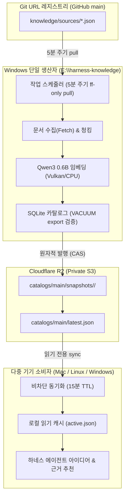

# 하네스 지식 라이브러리(Knowledge Library) 운영 매뉴얼

> **문서 상태**: 운영 표준 (Step 15: knowledge-status-docs)  
> **최초 작성일**: 2026-10-09 (Asia/Seoul)  
> **적용 대상**: Windows 단일 생산자(Producer), Mac/Linux 소비자(Reader), 운영자 및 하네스 관리자  

---

## 1. 개요 및 운영 아키텍처

create-agent-harness의 지식 라이브러리는 Git 기반 URL 레지스트리, Windows 전용 생산자(Producer), Private Cloudflare R2 스토리지, 그리고 다중 기기(Mac/Linux/Windows)의 로컬 읽기 전용 캐시(Reader)로 구성됩니다.



### 1.1 핵심 운영 원칙
1. **단일 생산자 / 다중 소비자**: 카탈로그 DB 쓰기 및 R2 업로드는 오직 사전에 지정된 1대의 Windows 생산자 머신에서만 수행됩니다. 모든 소비 기기는 불변 스냅샷을 읽기 전용으로만 사용합니다.
2. **원자적 불변 세대(Immutable Generation)**: 한 번 발행된 세대 디렉터리는 절대 수정되지 않습니다. 새로운 변경 사항은 항상 새로운 generation 디렉터리로 발행되며 최종적으로 `latest.json` 포인터를 원자적으로 교체합니다.
3. **발행 성공과 원문 최신화의 분리**: 스냅샷이 정상적으로 발행되었더라도 외부 웹사이트 일시 장애, Rate limit(429) 등으로 일부 소스 수집이 실패했을 수 있습니다. 상태 점검 시 반드시 실패 소스(failed sources) 목록을 확인해야 합니다.
4. **자격증명 및 비밀정보 격리**: 운영 문서, 로그, Git 커밋에는 어떠한 실제 API 키, 토큰, 엔드포인트 계정 ID도 포함되지 않아야 합니다.

---

## 2. Windows 생산자 설정 및 스케줄러 등록

Windows 머신(예: i5-12400F, RX 6700 XT 12GiB, 기본 경로 `E:\harness-knowledge`)에서 단일 백그라운드 프로세스로 동작하도록 구성합니다.

### 2.1 디렉터리 레이아웃
생산자 머신의 전용 데이터 드라이브에 아래 구조를 준비합니다.
```text
E:\harness-knowledge\
  ├── config.json              # 생산자 로컬 환경 설정 (비밀값 제외)
  ├── runtime\
  │   ├── bin\                 # llama-server 실행 바이너리 (Vulkan/CPU)
  │   ├── models\              # qwen3-embedding-0.6b-q8_0.gguf 모델 파일
  │   └── node_modules\        # 선택 의존성 (sqlite-vec 등)
  ├── producer\
  │   ├── catalog.sqlite       # 단일 쓰기 원본 SQLite 데이터베이스
  │   ├── jobs\
  │   │   └── ledger.json      # 영속 작업 큐 및 상태 레저
  │   └── sync-ledger.json     # Git 동기화 커밋 및 소스별 커서
  └── snapshots\               # 로컬 검증 및 보관 세대
```

### 2.2 작업 스케줄러(Task Scheduler) 등록
생산자는 Windows 작업 스케줄러를 통해 5분마다 자동 실행됩니다. 스케줄러는 중복 실행을 방지하며, 프로세스 시작 시 무작위 지터(Jitter: 0~30초)를 부여하여 네트워크 스파이크를 분산합니다.

#### 작업 스케줄러 등록 PowerShell 스크립트 예시
> **주의**: PowerShell 5.1 호환성을 위해 `.ps1` 파일 저장 시 반드시 **UTF-8 with BOM**으로 인코딩해야 합니다.

```powershell
# Windows PowerShell (관리자 권한)
$TaskName = "HarnessKnowledgeProducer"
$NodeExe = (Get-Command node).Source
$ScriptPath = "E:\harness-knowledge\runtime\release\scripts\knowledge\producer.ts"
$WorkingDir = "E:\harness-knowledge\producer-repo"

# 5분 주기 반복 트리거 설정
$Trigger = New-ScheduledTaskTrigger -Once -At (Get-Date) -RepetitionInterval (New-TimeSpan -Minutes 5)

# 실행 동작 정의 (지터 적용 및 백그라운드 실행)
$Action = New-ScheduledTaskAction `
    -Execute $NodeExe `
    -Argument "--experimental-strip-types `"$ScriptPath`" --jitter 30" `
    -WorkingDirectory $WorkingDir

# 동시 실행 방지(IgnoreNew) 및 실행 시간 제한(15분)
$Settings = New-ScheduledTaskSettingsSet `
    -MultipleInstances IgnoreNew `
    -ExecutionTimeLimit (New-TimeSpan -Minutes 15) `
    -RestartCount 3 `
    -RestartInterval (New-TimeSpan -Minutes 1)

Register-ScheduledTask `
    -TaskName $TaskName `
    -Trigger $Trigger `
    -Action $Action `
    -Settings $Settings `
    -Description "Harness Knowledge Library Windows Producer Loop"
```

### 2.3 수동 1회성 실행 (One-shot Trigger)
정기 스케줄 주기와 무관하게 즉시 수집·임베딩·발행을 1회 실행하려면 아래 명령을 사용합니다:
```bash
# 생산자 전용 작업 디렉터리에서 실행
npx tsx scripts/knowledge/producer.ts --run-once
```

---

## 3. Cloudflare R2 자격증명 설정 및 최소 권한(Least-Privilege) 분리

Cloudflare R2는 카탈로그 스냅샷을 배포하는 중앙 객체 저장소입니다. 보안을 위해 **생산자 쓰기 계정**과 **소비자 읽기 전용 계정**의 자격증명을 엄격히 분리합니다.

### 3.1 권한 분리 원칙
| 역할 | 대상 기기 | 필요 R2 권한 (Cloudflare API Token) | 허용된 객체 키 접두사 |
| --- | --- | --- | --- |
| **Producer** (쓰기) | Windows 생산자 PC 1대 | `Object Read & Write` | `catalogs/main/*` |
| **Reader** (읽기) | Mac, 개발자 PC, CI | `Object Read Only` (GetObject, HeadObject) | `catalogs/main/*` |

### 3.2 환경 변수 구성
자격증명은 코드나 설정 파일에 저장하지 않고 시스템 환경 변수 또는 OS 키체인에서 로드합니다.

#### 1) Windows 생산자 환경 변수 (시스템 설정)
```powershell
[System.Environment]::SetEnvironmentVariable("HARNESS_KNOWLEDGE_ROLE", "producer", "Machine")
[System.Environment]::SetEnvironmentVariable("HARNESS_KNOWLEDGE_PRODUCER_DIR", "E:\harness-knowledge", "Machine")
[System.Environment]::SetEnvironmentVariable("HARNESS_R2_ACCOUNT_ID", "<CLOUDFLARE_ACCOUNT_ID>", "Machine")
[System.Environment]::SetEnvironmentVariable("HARNESS_R2_ACCESS_KEY_ID", "<PRODUCER_WRITE_KEY_ID>", "Machine")
[System.Environment]::SetEnvironmentVariable("HARNESS_R2_SECRET_ACCESS_KEY", "<PRODUCER_WRITE_SECRET_KEY>", "Machine")
[System.Environment]::SetEnvironmentVariable("HARNESS_R2_BUCKET", "harness-knowledge-prod", "Machine")
```

#### 2) Mac / Linux 소비자 환경 변수 (`~/.zshrc` 또는 `~/.bashrc`)
```bash
# 읽기 전용 자격증명 구성
export HARNESS_R2_ACCOUNT_ID="<CLOUDFLARE_ACCOUNT_ID>"
export HARNESS_R2_ACCESS_KEY_ID="<READER_READONLY_KEY_ID>"
export HARNESS_R2_SECRET_ACCESS_KEY="<READER_READONLY_SECRET_KEY>"
export HARNESS_R2_BUCKET="harness-knowledge-prod"
```

---

## 4. 일상 운영 절차 (Operational Procedures)

### 4.1 상태 점검 (Status Inspection)
현재 등록된 소스의 수집 단계, 큐 대기 현황, 마지막 성공 시각, 실패 원인을 확인합니다.

```bash
# 한국어 대화형 보고서 출력
npx tsx scripts/knowledge/status.ts

# 기계 판독용 JSON 출력 (모니터링 연동용)
npx tsx scripts/knowledge/status.ts --json

# 특정 프로젝트 루트 지정
npx tsx scripts/knowledge/status.ts --project-root /path/to/project
```

#### 출력 예시 (발행 성공과 소스 실패 분리 진단)
```text
================================================================================
  하네스 지식 라이브러리(Knowledge Library) 상태 보고서
  조회 시각: 2026-10-09 11:00:00 (+09:00)
================================================================================
[1] 등록 레지스트리 (Registry Status)
- 총 등록 소스: 15개 (활성: 14개, 비활성: 1개)
- 소스 유형별:
  • GitHub 저장소 (github-repo): 10개
  • GitHub 별표 (github-stars): 1개
  • 일반 웹 문서 (web): 4개

[2] 생산자 파이프라인 (Producer Status - Windows)
- 최근 실행 이력 (Asia/Seoul):
  • 마지막 Git Pull 커밋: 3f8a91b2c4...
  • 마지막 문서 수집 (Fetch): 2026-10-09 10:52:14 (+09:00)
  • 마지막 임베딩 (Embed): 2026-10-09 10:53:30 (+09:00)
  • 마지막 스냅샷 발행 (Publish): 2026-10-09 10:55:00 (+09:00)
- 큐 작업 현황:
  • 대기: 0건 | 진행 중: 0건 | 완료: 13건 | 실패: 1건 | 건너뜀: 0건
- 수집 실패 소스 목록 (1건):
  [1] 소스 ID: e9b4c12d...
      URL: https://api.broken-site.com/docs
      오류 유형: RATE_LIMITED
      오류 원인: HTTP 429 Too Many Requests
      시도 횟수: 3/3
      다음 재시도: 최대 시도 횟수 초과 (수동 재설정 필요)

[3] 소비자 로컬 캐시 (Reader Status)
- 상태: 정상 (available)
- 활성 세대 (Generation): gen_20261009_105500
- 보관된 스냅샷 세대 수: 3개
- 마지막 동기화 성공: 2026-10-09 10:58:12 (+09:00)
- 검색 모드: vector (벡터 + FTS 하이브리드)
- 색인 규모: 문서 13개 / 청크 62개

[4] 원문 최신화 및 발행 분리 진단 (Freshness & Integrity)
⚠️ 주의: 스냅샷 발행 성공이 전체 등록 소스의 최신화를 의미하지 않습니다.
실패한 소스(1건)가 존재하므로 일부 원문은 구버전이거나 인덱스에서 누락되었을 수 있습니다.
================================================================================
```

### 4.2 생산자 일시 중지 (Stop)
점검 또는 긴급 유지보수를 위해 생산자를 중지합니다:
```powershell
# Windows 작업 스케줄러 작업 비활성화
Disable-ScheduledTask -TaskName "HarnessKnowledgeProducer"

# 현재 실행 중인 생산자 노드 프로세스가 있다면 안전 종료
Get-Process node | Where-Object { $_.CommandLine -like "*producer.ts*" } | Stop-Process
```

### 4.3 생산자 재개 (Resume)
유지보수 완료 후 스케줄러를 재활성화합니다. 만료된 작업 리스는 최초 실행 시 자동으로 복구됩니다.
```powershell
Enable-ScheduledTask -TaskName "HarnessKnowledgeProducer"
# 즉시 1회 실행하여 정상 기동 확인
Start-ScheduledTask -TaskName "HarnessKnowledgeProducer"
```

### 4.4 특정 소스 수동 재수집 및 강제 재빌드 (Manual Rebuild)
특정 소스의 내용이 원격에서 바뀌었으나 ETag/TTL 등으로 즉시 반영되지 않거나, 실패 상태에서 즉시 재시도하려는 경우:
```bash
# 1. 특정 소스 작업 상태를 pending으로 리셋
npx tsx scripts/knowledge/intake.ts reset-job --source-id <SOURCE_ID>

# 2. 생산자 1회 수동 실행하여 즉시 수집·임베딩·발행 트리거
npx tsx scripts/knowledge/producer.ts --run-once
```

카탈로그 전체를 바닥부터 완전히 재구축해야 하는 경우:
```bash
# 전체 세대 재생성 모드로 생산자 실행 (기존 DB를 덮어쓰지 않고 새 generation ID 생성)
npx tsx scripts/knowledge/producer.ts --full-rebuild
```

### 4.5 이전 스냅샷 세대로 롤백 (Rollback)
새로 발행된 세대에 모델 비호환성이나 예기치 못한 데이터 왜곡이 발생한 경우, 소비 기기는 즉시 이전 세대로 롤백할 수 있습니다.

1. 로컬 캐시 디렉터리(`snapshots/`)에서 보관 중인 직전 세대를 확인합니다:
   ```bash
   ls -la "$HARNESS_KNOWLEDGE_HOME/snapshots"
   # 예: gen_20261009_100000, gen_20261009_105500
   ```
2. 직전 세대의 `manifest.json`을 검증한 뒤 `active.json` 포인터를 원자적으로 교체합니다:
   ```bash
   npx tsx scripts/knowledge/reader.ts rollback --generation gen_20261009_100000
   ```
3. 상태 점검 명령으로 롤백이 정상 적용되었는지 확인합니다:
   ```bash
   npx tsx scripts/knowledge/status.ts
   ```

---

## 5. 장애 조치 및 트러블슈팅 (Troubleshooting)

### 5.1 파일 락(Lock) 충돌 및 만료 락 복구
하네스는 동시성 충돌을 방지하기 위해 파일 락을 사용합니다. 프로세스가 비정상 종료(`SIGKILL`, 전원 차단 등)되어 락이 남은 경우의 조치 방법입니다.

| 락 파일 위치 | 용도 | 기본 임대 시간(Lease) | 복구 방법 |
| --- | --- | --- | --- |
| `<cacheDir>/sync.lock` | 다중 프로젝트 동시 다운로드 방지 | 30초 | 30초 경과 시 자동 만료되어 후속 프로세스가 획득. 수동 해제 필요 시 파일 삭제 |
| `producer/jobs/ledger.json.lock` | 작업 큐 원자적 쓰기 보호 | 30초 | 30초 초과 시 자동 해제. 지속 시 프로세스 확인 후 삭제 |
| `producer/catalog.sqlite` | SQLite 단일 쓰기 트랜잭션 | busy timeout 10초 | 프로세스 종료 확인 후 재시도 |

#### 수동 락 정리 (프로세스가 종료되었음을 확인한 후 실행)
```bash
# 소비자 sync lock 정리
rm -f "$HARNESS_KNOWLEDGE_HOME/sync.lock"

# 생산자 queue lock 정리 (Windows)
Remove-Item "E:\harness-knowledge\producer\jobs\ledger.json.lock" -Force -ErrorAction SilentlyContinue
```

### 5.2 수집 실패 소스(Failed Sources) 진단 및 대처
상태 보고서의 `failed_sources`에 표시되는 주요 오류 유형과 조치 절차입니다:

1. **`RATE_LIMITED` (HTTP 429)**
   - 원인: GitHub REST API 또는 외부 웹사이트의 시간당 요청 한도 초과.
   - 조치: GitHub Personal Access Token이 등록되어 있는지 확인(`GITHUB_TOKEN`). 해당 소스의 `refresh_hours`를 늘려 요청 주기를 완화합니다.
2. **`SECURITY_DENIED` (사설망/SSRF 차단)**
   - 원인: `localhost`, 사설망 IP 대역(`10.x`, `192.168.x` 등)으로의 리다이렉션 또는 입력 시도 감지.
   - 조치: 보안상 사설망 수집은 절대 허용되지 않습니다. URL을 올바른 공개 주소로 수정하거나 레지스트리에서 비활성화(`enabled: false`)합니다.
3. **`TIMEOUT` / `DNS_FAILURE`**
   - 원인: 일시적인 원격 사이트 다운 또는 DNS 해석 실패.
   - 조치: 작업 큐의 기본 재시도(최대 3회) 후에도 실패하면 수동으로 사이트 생존 여부를 브라우저에서 확인합니다.

### 5.3 생산자 Git Clone 충돌(Dirty / Divergence) 처리
생산자는 `git pull --ff-only`만 수행하도록 계약되어 있습니다. 사용자가 생산자 전용 clone 내부에서 파일을 직접 수정하거나 임의 커밋을 생성한 경우:

> **절대 금지**: 생산자 스크립트는 `git reset --hard`나 `git push`를 절대 자동 실행하지 않습니다.

#### 수동 복구 절차:
1. 생산자 전용 저장소 디렉터리로 이동합니다.
2. 변경 사항을 확인합니다:
   ```bash
   git status --porcelain
   ```
3. 작업 디렉터리에 생성된 불필요한 미추적/수정 파일이 있다면 안전한 임시 디렉터리로 이동하거나 백업 후 제거합니다:
   ```bash
   git stash --include-untracked
   ```
4. 업스트림 main 브랜치와 fast-forward 정렬합니다:
   ```bash
   git pull --ff-only origin main
   ```
5. 생산자 1회 실행으로 정상 작동을 검증합니다:
   ```bash
   npx tsx scripts/knowledge/producer.ts --run-once
   ```

---

## 6. 환경 변수 참조 명세 (Environment Variables Reference)

하네스 지식 라이브러리가 참조하는 모든 환경 변수의 목록입니다. **실제 보안 자격증명 값은 절대 본 문서나 Git에 기록하지 마십시오.**

| 환경 변수 이름 | 역할 및 설명 | 기본값 | 사용 대상 |
| --- | --- | --- | --- |
| `HARNESS_KNOWLEDGE_HOME` | 지식 라이브러리 루트 데이터 디렉터리 경로 | OS별 기본 사용자 데이터 경로 | 공통 (Producer & Reader) |
| `HARNESS_KNOWLEDGE_ROLE` | 기기의 라이브러리 역할 지정 (`producer` 또는 `reader`) | `reader` | 생산자 머신 전용 |
| `HARNESS_KNOWLEDGE_PRODUCER_DIR` | Windows 생산자 전용 데이터 저장 루트 | `E:\harness-knowledge` | 생산자 머신 전용 |
| `HARNESS_R2_ACCOUNT_ID` | Cloudflare R2 계정 식별자 (32자리 16진수) | (필수) | 공통 (R2 연동 시) |
| `HARNESS_R2_ACCESS_KEY_ID` | Cloudflare R2 S3 호환 Access Key ID | (필수) | 공통 (역할별 키 분리) |
| `HARNESS_R2_SECRET_ACCESS_KEY` | Cloudflare R2 S3 호환 Secret Access Key | (필수) | 공통 (역할별 키 분리) |
| `HARNESS_R2_BUCKET` | 카탈로그 스냅샷을 저장할 R2 버킷 이름 | `harness-knowledge-prod` | 공통 |
| `HARNESS_R2_ENDPOINT` | R2 사용자 지정 엔드포인트 URL (미지정 시 자동 계산) | `https://<ACCOUNT_ID>.r2.cloudflarestorage.com` | 공통 (선택 사항) |
| `GITHUB_TOKEN` | GitHub API 호출 시 Rate limit 완화용 토큰 | (선택 사항) | 생산자 머신 전용 |

---

## 7. 정기 감사 및 유지보수 점검표 (Maintenance Checklist)

- [ ] **주간 상태 점검**: `npx tsx scripts/knowledge/status.ts` 실행 후 `failed_sources` 0건 여부 확인.
- [ ] **디스크 여유 공간 점검**: 생산자 `E:\harness-knowledge` 드라이브의 여유 공간이 최소 20GiB 이상 유지되는지 확인.
- [ ] **스냅샷 보존 상태**: 로컬 및 R2 버킷에 최근 정상 세대 최소 3개가 안정적으로 보존되고 있는지 점검.
- [ ] **권한 최소화 감사**: 소비자 기기에서 R2 업로드(`PutObject`) 권한이 차단되어 있는지 정기적 검증.
